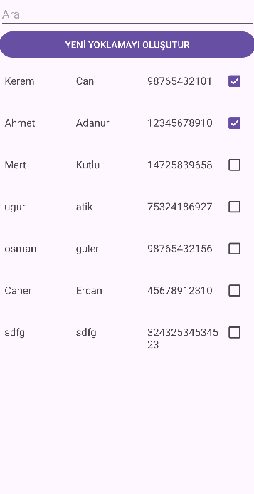
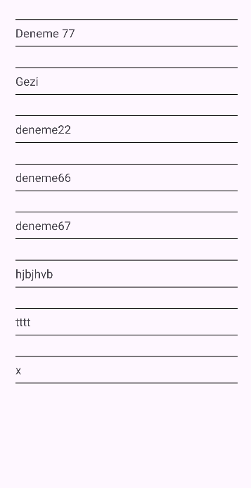
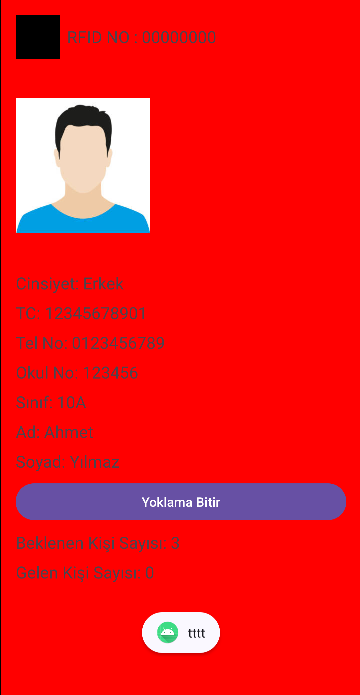
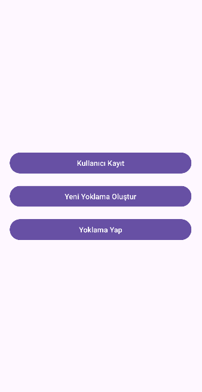
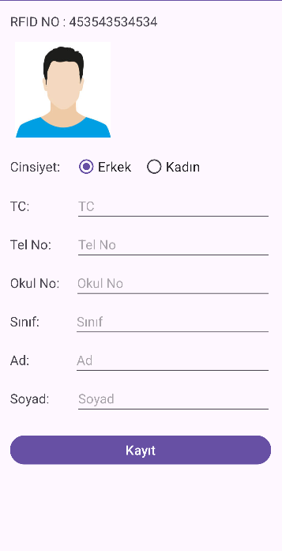

Bu proje, Android Studio ile geliştirilmiş bir Android uygulaması ve Arduino kullanarak Firebase veritabanına bağlanan bir yoklama sistemini içermektedir. Sistem, kullanıcıların Android uygulaması üzerinden yoklama almasını sağlar ve veriler Firebase veritabanına kaydedilir. Arduino, internet bağlantısını sağlamak için bir Wi-Fi modülü kullanır ve verileri Firebase'e ileterek Android uygulaması ile senkronize eder.

Teknolojiler:
Android Studio (Java/Kotlin)
Firebase Realtime Database
Arduino (ESP8266/ESP32 Wi-Fi modülü)
Firebase Authentication (isteğe bağlı)
Wi-Fi Bağlantısı

| Görsel 1 | Görsel 2 | Görsel 3 |
|----------|----------|----------|
|  |  |  |

| Görsel 4 | Görsel 5 | Görsel 6 |
|----------|----------|----------|
|  |  |  |
